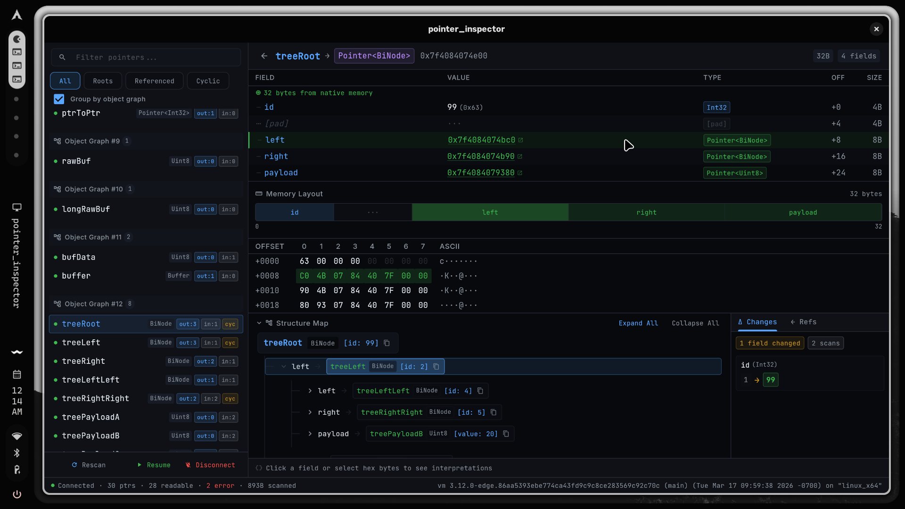
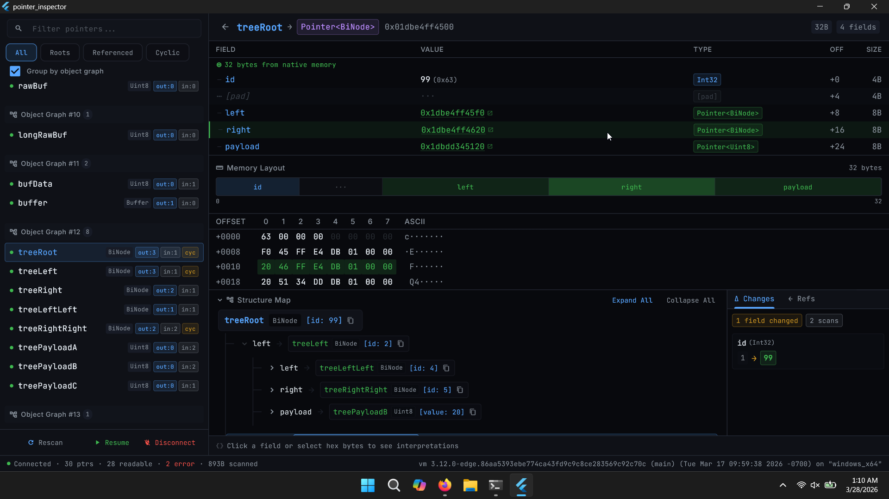

# Native Memory Inspector Prototype (Dart VM / DevTools)

This repo contains a working prototype for inspecting Dart FFI native memory during debugging.

### 🎥 Watch the Demo Videos
- **[Main Demo (Arch Linux, with audio)](https://www.youtube.com/watch?v=OLLlGJSXVmY)**: A walkthrough of the prototype's full capabilities. I show how it recovers declared types and demonstrate the memory inspector safely reading, decoding, and exploring structs in real time.
- **[Windows Validation (No audio)](https://www.youtube.com/watch?v=Qdb_-aSBWQE)**: A quick video proving that the native safe-read API works correctly on 64-bit Windows without crashing the VM on bad pointers.

Main pieces:
- VM-side patch set (`sdk_patches/`) for declared type metadata, pointer metadata, and safe native-memory reads.
- Desktop inspector client (`inspector_app/`) that connects to VM service and decodes pointer-backed data.
- Deterministic FFI target (`target_app/`) that produces repeatable pointer scenarios.
- Lightweight protocol probe (`experiments/stack_probe/`) for quick VM payload/debug checks.

## SDK Baseline Used

All patches were applied and tested against Dart SDK commit:
- `86aa5393ebe`  
(`86aa5393ebe774ca43fd9c9c8ce283569c92c70c`)

## What Is In This Repo

- `sdk_patches/`
  - `01_declared_type_protocol_and_dap.patch`
  - `02_declared_type_local_var_metadata.patch`
  - `03_pointer_metadata_and_read_native_memory.patch`

- `inspector_app/`
  - Flutter desktop inspector UI + VM service extraction/decoding logic.

- `target_app/`
  - Dart FFI target with structs/unions/arrays/pointer graphs, cycles, and safety-failure cases.

- `tests/test_memory_read.c`
  - Cross-platform native read safety test.

- `experiments/stack_probe/`
  - Minimal stack/protocol probe used during development to validate VM payload shape quickly.

## Current Validation Findings

- Runtime validation completed on:
  - Arch Linux (Intel x86_64)
  - Windows 11 x64
- I wasn’t able to run full macOS runtime validation yet because I don’t have
  access to macOS hardware.

- Verified behavior:
  - end-to-end inspection flow is working on both validated platforms,
  - pointer extraction + decoding works across basic and advanced patterns,
  - invalid/unmapped pointer reads return structured errors (no crash),
  - `_readNativeMemory` address/count parsing is implemented with `UInt64Parameter` for correct 64-bit handling.

Cross-platform native-read CI result:
- <https://github.com/Shanu-Kumawat/native_memory_project/actions/>


## Tests In Repo

- `inspector_app/test/struct_layout_test.dart`
  - layout/type model checks used by the inspector decode path.
- `inspector_app/test/widget_test.dart`
  - basic app render smoke test.
- `tests/test_memory_read.c`
  - native read safety/behavior test across platforms.

## Screenshots

### Arch Linux (Primary Inspector Environment)


### Windows 11 x64 (Cross-Platform Memory Validation)


## Quick Setup and Run/Test

### 1) Apply patch set on clean SDK checkout

From SDK root (checked out at commit `86aa5393ebe...`):

```bash
git apply ../sdk_patches/01_declared_type_protocol_and_dap.patch
git apply ../sdk_patches/02_declared_type_local_var_metadata.patch
git apply ../sdk_patches/03_pointer_metadata_and_read_native_memory.patch
```

Windows (PowerShell, CRLF-safe apply):
```powershell
git apply --ignore-space-change --ignore-whitespace ..\sdk_patches\01_declared_type_protocol_and_dap.patch
git apply --ignore-space-change --ignore-whitespace ..\sdk_patches\02_declared_type_local_var_metadata.patch
git apply --ignore-space-change --ignore-whitespace ..\sdk_patches\03_pointer_metadata_and_read_native_memory.patch
```

### 2) Build patched SDK (primary path)

From SDK root:

```bash
python3 tools/build.py -m release -a x64 create_sdk
```

### 3) Run target and inspector

From repository root:

Run target app:
```bash
cd target_app
../sdk/out/ReleaseX64/dart-sdk/bin/dart --enable-vm-service run bin/main.dart
```

On Windows (PowerShell):
```powershell
cd target_app
..\sdk\out\ReleaseX64\dart-sdk\bin\dart.exe --enable-vm-service run bin\main.dart
```

Run inspector app:
```bash
cd inspector_app
flutter pub get
flutter run
```

Connect `inspector_app` to the VM service URL printed by `target_app`.

### 4) Run tests

From repository root:

Inspector tests:
```bash
cd inspector_app
flutter test
```

Native read safety test:
```bash
cc tests/test_memory_read.c -o /tmp/test_memory_read
/tmp/test_memory_read
```

## Platform Coverage Note

- Verified on: Arch Linux (Intel x86_64) and Windows 11 x64.
- I do not currently have access to macOS hardware, so I could not run full
  end-to-end runtime validation.
